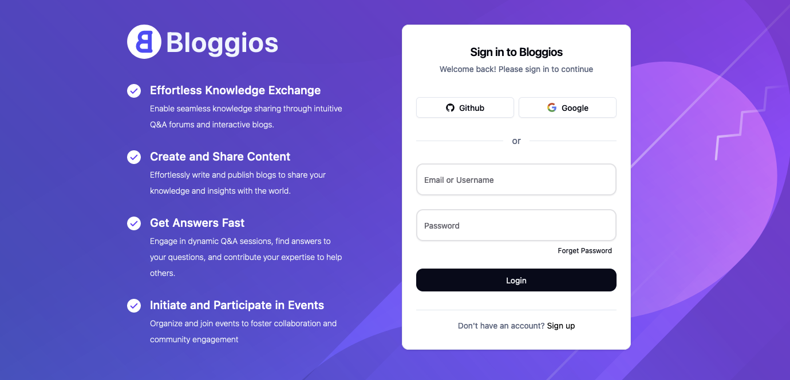

<div align="center">
  <br />
    <a href="https://bloggios.com" target="_blank">
      
    </a>
  <br />

<h2 align="center">User Provider Application</h2>

  <div>
    
    
    
    
    
  </div>
</div>

## 📋 <a name="table">Table of Contents</a>

1. 🤖 [Introduction](#introduction)
2. ⚙️ [Tech Stack](#tech-stack)
3. 🔋 [Documentation](#documentation)
4. 🤸 [Quick Start](#quick-start)
5. 🕸️ [Contributing](#contributing)
6. 🔗 [Links](#links)
7. 🙏 [Support](#support)
8. ✨ [Contributors](#contributors)

## <a name="introduction">🤖 Introduction</a>

The User Provider Application, developed using Java 17 and Spring Boot, is a vital microservice dedicated to the
management of user data. This microservice is designed to handle a comprehensive range of user-related activities,
ensuring efficient and reliable operations. Key functionalities include managing user profiles, settings, and
follow-following relationships. By centralizing these tasks, the User Provider Application plays a crucial role in
maintaining a seamless and cohesive user experience within the broader system architecture. Its robust implementation
ensures scalability and performance, making it an essential component of the overall infrastructure.

## Key Features

- **User Profile Management:**: Create, update, delete, and retrieve detailed user information.
- **User Settings Management:**: Handle user-specific settings and preferences with secure storage and retrieval.
- **Follow-Following System:**: Implement follow and unfollow functionalities, maintaining relationships between users.
- **Authentication and Authorization:**: Provide secure authentication and authorization, managing roles and permissions.

Join our newly active Discord community for support, bug reporting, and feature requests. Here, we strive to address
every issue, and developers and testers can collaborate and assist each other effectively.

<a href="https://discord.gg/sEerF8HuKC" target="_blank">

</a>

## <a name="tech-stack">⚙️ Tech Stack</a>

- Java 17
- Spring Boot
- PostgreSQL
- Elasticsearch
- OAuth2.0
- Kafka

## <a name="documentation">🔋 API Documentation</a>

To help you get started with our API and understand all its features and endpoints, we have created detailed
documentation available on Postman. This documentation includes comprehensive information about each endpoint,
including:

- **Endpoint URLs**: Specific paths to access various functionalities.
- **HTTP Methods**: The method type (GET, POST, PUT, DELETE, etc.) for each endpoint.
- **Parameters**: Required and optional parameters, including headers, query parameters, and body content.
- **Request Examples**: Sample requests to demonstrate proper usage.
- **Response Formats**: Expected response structure, including status codes and data formats.
- **Error Handling**: Common error responses and troubleshooting tips.

To access the documentation:

1. **Visit our Postman Documentation Page
   **: [Visit Documentation](https://www.postman.com/rohit-zip/workspace/bloggios/collection/34920421-dbc22257-2de7-4888-a0b1-69d0234bb3b4?action=share&source=copy-link&creator=34920421)
2. **Explore the Collection**: Navigate through the collection to find detailed descriptions and examples for each
   endpoint.
3. **Run Requests Directly in Postman**: Use the "Run in Postman" button to directly import the collection into your
   Postman workspace for testing and exploration.

By leveraging the Postman documentation, you can quickly integrate our API into your application and take full advantage
of its capabilities.

For any further assistance, feel free to contact our support team or refer to the additional resources section in the
documentation.

## <a name="quick-start">🤸 Quick Start</a>

Follow these steps to set up the project locally on your machine.

**Prerequisites**

Make sure you have the following installed on your machine:

- Git
- Java 17
- Intellij Idea or any other IDE supports Spring Boot
- PostgreSql
- Elasticsearch
- Kafka
- Docker (If not want to install PostgreSQL, Elasticsearch and Kafka seperately)

**Cloning the Repository**

```bash
git clone <repository-url>
```

**Opening the Project**

Open the project in any of your favourite IDE
We recommended Intellij Idea

Make sure you have Java 17 Installed in your system
Please execute the below command to check installed version of Java in your system

```bash
java --version
```

**Set Up Environment Variables**

Navigate to `src/main/resources/application.yml` and add the required environment variables

If you are new at setting environment variables the please go through the below videos

- Intellij Idea [See Video](https://www.youtube.com/watch?v=jNOh4jQJG2U)
- Eclipse or STS [See Video](https://www.youtube.com/watch?v=ypvGDkbp8Ac)

```env
BOOTSTRAP_SERVER -> Link to kafka broker server. You can start kafka broker locally (localhost:9092)
ES_PASSWORD -> Password of your Elasticsearch
ES_SERVER -> Elastic Search password Link (localhost:9200)
ES_USERNAME -> Elasticsearch Username
GOOGLE_CLIENT_ID -> Give any random value or if want to test Google OAuth Locally then generate client id and secret from Google Developer Console
GOOGLE_CLIENT_SECRET -> Give any random value or if want to test Google OAuth Locally then generate client id and secret from Google Developer Console
POSTGRES_DATABASE -> Postgresql Database name
POSTGRES_HOST -> Postgres Database Host
POSTGRES_PASSWORD -> Postgres Database Password
POSTGRES_USERNAME -> Postgresq Database Username
```

Replace the placeholder values with your actual credentials

**Running the Project**

Navigate to `src/main/java/com/bloggios/auth/provider/UserProviderApplication.java`
Run the main method

## <a name="contributing">🧑‍💻Contributing</a>

Any kind of positive contribution is welcome! Please help us to grow by contributing to the project.

If you wish to contribute, you can,

- Star Repositories Bloggios
- Suggest a Feature
- Test the application, and help it improve.
- Improve the app, fix bugs, etc.
- Improve documentation.
- Create content about Bloggios and share it with the world.

> Please read [`CONTRIBUTING`](CONTRIBUTING.md) for details on our [`CODE OF CONDUCT`](CODE_OF_CONDUCT.md), and the
> process for submitting pull requests to us.

🆕 New to Open Source? 💡 Follow this [guide](https://opensource.guide/how-to-contribute/) to jumpstart your Open Source
journey 🚀.

## <a name="links">🔗 Links</a>

- **Devsanbox API's URL** - https://api.bloggios.in (Bloggios Devsandbox API)
- **Devsandbox Environment** - https://dev.bloggios.in (Bloggios Devsandbox) (*Not Deployed yet*)
- **Production Environment** - Not Deployed yet

**Repositories**

- **Auth Provider Application** - [Visit Github](https://github.com/Bloggios/auth-provider-application)
- **Bloggios Mail Service** - [Visit Github](https://github.com/Bloggios/bloggios-mail-service)
- **Bloggios Web UI** - [Visit Github](https://github.com/Bloggios/bloggios-web-ui)

## <a name="support">🙏Support</a>

We all need support and motivation. `Bloggios` is not an exception. Please give this project repositories a ⭐️ to
encourage and show that you liked it. Don't forget to leave a star ⭐️ before you move away.

If you found the app helpful, consider supporting us with a coffee.

## <a name="contributors">✨Contributors</a>

Thanks goes to these wonderful people ([emoji key](https://allcontributors.org/docs/en/emoji-key)):

<!-- ALL-CONTRIBUTORS-LIST:START - Do not remove or modify this section -->
<!-- prettier-ignore-start -->
<!-- markdownlint-disable -->
<table>
  <tbody>
    <tr>
      <td align="center" valign="top" width="14.28%"><a href="https://github.com/rohit-zip"><br /><sub><b>Rohit Parihar</b></sub></a><br /><a href="https://github.com/rohit-zip" title="Code">💻</a></td>
    </tr>
  </tbody>
</table>